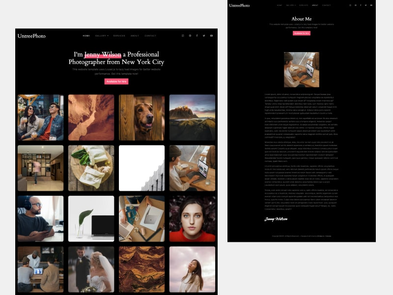

# Sugar Candy Gallery

Sugar sweet photo gallery Quiqr Template.

## History

This is the UntreePhoto HTML template transformed into a Jekyll theme, ported
to Hugo with a Quiqr CMS Model.

## Jekyll Theme

http://sugarcandy.cz/

## HTML design and template

- Template Name: **UntreePhoto**
- Template Author: **Untree.co**
- Template License: **https://creativecommons.org/licenses/by/3.0/**
- Author URI: **https://untree.co/**
- Twitter: **https://twitter.com/Untree_co**

# LICENSE

## HTML Template

All html templates of [Untree.co](https://untree.co) are licensed under the [Creative Common Attribution 3.0 Unported (CC BY 3.0)](https://creativecommons.org/licenses/by/3.0/). Therefore you CAN:

- Use these templates for personal projects
- Use these templates for commercial projects
- Change them however you like

## With such privileges you CANNOT:

- Remove the backlink of [Untree.co](https://untree.co) on footers of every templates
- Redistribute all templates from Untree.co

## Remove Backlink

We have put our best efforts into creating those templates. Hence, it would be best to give us the appropriate credit, provide a link to [Untree.co](https://untree.co) on your websites.

HOWEVER, if you may need to remove the credit links you can pay [Untree.co](https://untree.co) $19 for a single exclusive template by contacting us at https://untree.co/contact/

